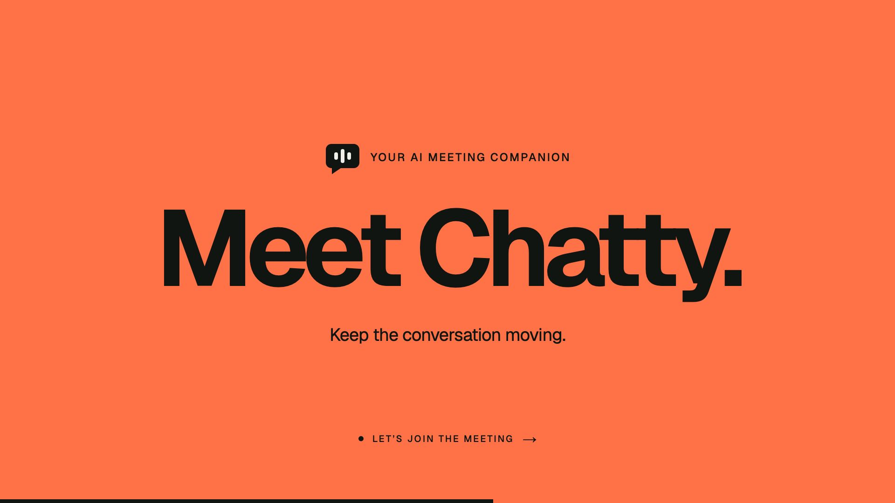

<h1 align="center">
  
</h1>

<strong>Less searching. More conversation.</strong>

Chatty is an AI meeting companion in development, bringing project context into your team’s conversations.

- Catch up on GitHub commits, pull requests, and issues.
- Follow source links to the original information.
- Turn an explicit request into a GitHub issue.

GitHub tools are implemented; the complete meeting experience is still in development.

  <a href="https://meetchatty.vercel.app/"><strong>Visit website ↗</strong></a> ·
  <a href="landing/dist/assets/chatty-intro.mp4">Watch the intro</a> ·
  <a href="src/chatty/integrations/github/README.md">Technical details</a>

---

  

